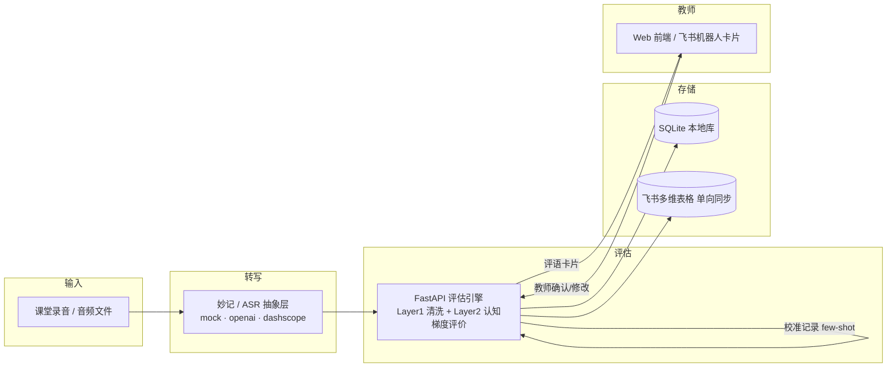

# 参赛方案草案：维学思辨星

> **状态**：草案 v0.1（2026-08-05 由现有 README / 开题报告 / 飞书集成方案 / 演示脚本整理）
> **用途**：按【40强赛模板】的必含模块组织，供队长补全后转成飞书文档提交。
> **待填项**：一律用【】标出；提交前须删除本说明块与所有【】占位。
> **提交截止**：2026-08-16（建议 8/15 前先提交占位链接，内容可持续更新到 8/14 冻结）。

---

## 一、参赛方案信息卡

| 项目 | 填写内容 |
|------|---------|
| 队名 | 【待填：队名】 |
| 命题 | 【按官方命题文案填写】2026 AI先锋未来人才大赛 · 飞书命题（教育 / 课堂评估场景） |
| 一句话摘要 | 面向 1–7 年级思辨课堂的 AI 辅助评估系统：按儿童认知发展阶段适配评价标尺，AI 承担转写、清洗、评分初稿与评语草稿，教师在每个关键节点做最终判断——"AI 准备，教师决定"。 |
| 成员介绍&分工 | 3 人，均为大二计算机系。A·队长【姓名】：产品设计与统筹、演示视频、PPT、参赛文档、对外沟通；B·队友【姓名】：后端与飞书集成（评估流水线、妙记/ASR、多维表格、机器人）；C·队友【姓名】：前端与体验（React 页面、演示数据、QA）。 |
| 使用的飞书 AI 能力 | 妙记（课堂语音自动转写，进入双层评估流水线）＋ 多维表格（评估数据沉淀与教师审阅面，AI 字段捷径辅助打标签，待实测）＋ 机器人（评语卡片推送与教师确认交互）。 |

---

## 二、方案成果展示

### 2.1 命题场景描述、问题描述及痛点说明

**业务场景**：少儿思辨课（1–7 年级）以口头表达为主要产出。这类课程的评价对象不是"标准答案"，而是学生如何提出主张、解释理由、使用证据、回应不同观点并调节自己的判断。

当前课堂的评价过程存在四个结构性痛点：

1. **年龄跨度大，同一套评分维度不公平**。1–2 年级孩子正在形成"理由可以支持观点"的意识，3–5 年级开始从单一确定答案走向多元观点，6–7 年级才逐步具备比较论据质量、回应反驳和反思判断的能力（Kuhn, 1999；Byrnes & Dunbar, 2014）。用同一套标准衡量所有年龄段，要么低估高年级，要么苛责低年级。
2. **表层表达不等于思维质量**。儿童口语中的停顿、重复、错别字和句式不完整会干扰通用 AI 模型，但这些噪声不能作为"思辨能力弱"的证据；同时，原始表达又是教师回看学生真实水平的依据，不能丢。
3. **教师被高频机械劳动挤占时间**。逐字整理课堂转写、逐维度汇总评分、从零撰写评语、人工统计班级画像——这些重复工作占用了本应花在教学判断和个性化反馈上的时间。
4. **全自动 AI 批改绕过教师判断**。研究显示 AI 过度接管评价环节会削弱学生的深度学习（相关实证见 README）；更重要的是，思辨评价天然包含教师根据课程目标与学生背景作出的主观校准，完全自动化会让评分失去可解释性与信任基础。

**核心洞察**：问题不在于"如何让 AI 完全取代教师评分"，而在于如何让 AI 的结构化分析适配儿童认知发展，并帮助教师更高效、更可解释地完成最终判断。

### 2.2 方案优势 / 创新点

**一句话亮点**：思辨题没有唯一答案——维学思辨星不替教师打分，而是把"不同年龄该评什么"和"教师怎么改"变成 AI 可执行、可回溯的评估流水线。

- **认知梯度 Rubric（核心创新）**：依据 Kuhn 认识论发展模型，将 1–7 年级划分为三个认知梯段（基础层 1–2 年级：清晰性/解释力/证据意识；发展层 3–5 年级：增加相关性/因果推理/证据使用；进阶层 6–7 年级：增加论证质量/深度广度/反思调节）。每个维度下设 A+/A/A-/B+/B/B- 六级行为锚点；A+ 仅表示明显超出年龄预期，B- 仅用于确实无法提取有效思维信息，孩子不会因为没有展现超出年龄阶段的能力而被扣分。论证质量维度吸收 McNeill CER 框架与 Osborne 课堂论证研究，将抽象的"逻辑好不好"转化为可检查的主张、证据、推理与反驳行为（rebuttal 缺失时论证质量不高于 B+）。
- **双层流水线解耦**：Layer 1 做语义无损的文本清洗（去除口语填充词、修正明显错别字、规范标点），产出 `cleaned_text`；Layer 2 只依据清洗后的语义结构做维度评估。原始 `raw_text` 始终保留供教师回看。两层解耦使未来替换语音识别（妙记 / OpenAI / DashScope）或接入 OCR 时，评估逻辑完全不受影响。
- **教师校准记忆**：教师每次覆盖 AI 评分，系统记录 AI 初评 → 教师终评 → 修改理由，存入 `calibration_records`；下次评估时把最近 10 条校准记录以紧凑示例注入 LLM prompt，让 AI 初稿逐步贴近该教师或机构的评价尺度——这是判断模式的传递，不是简单的"平均上调 0.5 级"。
- **教师决策门**：系统在评分确认、标签选择、批注、评语定稿、发送给学生等每个主观评价节点都保留教师决策；所有结果可解释、可回溯。

**Before → After**

| | Before | After |
|---|---|---|
| 课堂转写 | 教师手动整理 30–60 分钟/节课，或转写后无人清洗 | 上传音频自动转写，口语噪声自动清洗，原文保留 |
| 评分 | 教师逐份打分，口径靠记忆，年龄差异无区分（实测约 3 分钟/条） | AI 按认知梯段出六级评分初稿＋推理链＋建议标签，教师逐维确认（实测 ≤1 分钟/条） |
| 校准 | 教师改分后无沉淀，下次 AI 依然"不听话" | 每次修改自动入库，成为后续评估的 few-shot 校准记忆 |
| 评语 | 每生从零撰写 3–5 分钟（企业确认） | 基于教师确认的评分/标签/批注生成草稿（实测 5.4s/条），教师编辑定稿后发送 |
| 备课与报告 | 人工汇总薄弱维度与班级画像 | 按辩题聚合薄弱维度、低分学生，自动生成班级多维报告 |

### 2.3 具体方案说明（突出 AI 能力）

**端到端流程**：

> 课堂音频 → 转写（妙记 / ASR 抽象层）→ 文本清洗（Layer 1）→ 认知梯度评价（Layer 2）→ 教师逐维确认 → 评语草稿与发送 → 备课建议 → 班级报告；评估结果同步沉淀到飞书多维表格，评语通过机器人卡片推送。

**五大功能模块**：

1. **课堂表达接入**：教师上传课堂音频（或粘贴转写文本）；音频经可插拔 ASR 层转写（演示保底 `mock`，可选 OpenAI / DashScope，飞书妙记作为 provider 预留）；转写文本保留说话人信息并写入 `raw_text`，标记来源（manual / audio）。
2. **双层评估流水线**：Layer 1 清洗文本；Layer 2 按学生所在认知梯段动态装配对应 rubric（`rubric_loader.py`），调用兼容 OpenAI 协议的 LLM（DashScope / DeepSeek / OpenAI 均可用），批量输出各维度六级评分＋推理链＋建议标签，并记录 AI 置信度。
3. **教师审阅与校准**：教师逐维度查看 AI 初稿，可改分、选标签、写批注；确认后系统自动生成校准记录（AI 初评 → 教师终评 → 理由），供后续评估注入。所有审阅结果可恢复、可导出。
4. **评语生成与备课辅助**：评语基于教师已确认的评分、标签和批注生成，支持批量生成与编辑后发送；备课页按辩题聚合薄弱维度与低分学生，支持讲评顺序调整与教学备注持久化。
5. **班级画像报告**：统一六级口径，展示班级均分、各辩题/维度表现、雷达图与 Top 标签统计，呈现教学线索而非自动化结论。

**飞书协作层（AI 应用深度）**：

- **妙记（语音转写）**：设计上课堂语音从飞书进来，转写结果直接进入双层流水线。当前比赛租户的妙记转写导出接口需要用户身份授权（错误码 99991679），已确认暂不可用，因此转写由 ASR 抽象层承接；妙记权限恢复后 `feishu/minutes.py` 可无感接回，前端零改动。**（提交前需在叙事中明确当前演示所使用的实际链路，避免与方案设计混淆）**
- **多维表格**：评估完成/教师保存后单向写入 4 张表（班级/辩题/学生/评估记录），字段含来源、原始与清洗文本、AI 评分与教师评分、标签、状态等；AI 字段捷径辅助打标签作为演示亮点。**（文档级权限完成后接入，当前状态：deferred）**
- **机器人**：评估完成后推送"待审清单"与"评语卡片"，教师可点卡片按钮确认/修改；回调落库并复用校准记录逻辑。当前提供应用机器人发送能力骨架，卡片回调与事件订阅在权限与公网回调就绪后联调（先轮询、后订阅）。

**技术栈**：

| 层次 | 技术 |
|------|------|
| 后端 | FastAPI + Uvicorn + SQLAlchemy |
| 数据库 | SQLite（本地为唯一事实源，多维表格单向同步） |
| LLM | OpenAI SDK（兼容 DashScope / DeepSeek / OpenAI） |
| ASR | 可插拔（mock / openai / dashscope / 妙记预留） |
| 前端 | React 18 + Vite + Zustand + Tailwind CSS |
| 部署 | GitHub Pages 纯前端 demo 模式（内置演示数据，无需后端）＋ FastAPI 本地/线上 |

### 2.4 方案价值

**量化收益测算（2026-08-14 真实链路实测：deepseek-v4-flash 评估/评语 + qwen3-asr-flash 转写）**：

| 环节 | 现状 | 使用后（实测） | 效率提升 |
|------|------|--------|---------|
| 课堂转写整理 | 教师手动 30–60 分钟/节课 | 45s 发言端到端转写 **3.1s**（RTF 0.07×），203 字；22 条样本平均逐字一致率 **99.0%**（最低 91.4%） | 分钟级自动转写＋清洗 |
| 维度评分 | 教师逐份人工评分（实测约 3 分钟/条），口径不一致 | AI 初稿 **26.4s/条** 批量生成（27/27、0 错误），教师审阅确认 **≤1 分钟/条**（实测） | 教师批改时间节省约 67%，AI 侧全自动 |
| 评语撰写 | 每生 3–5 分钟从零写（企业确认） | 逐学生 **5.4s/条**（批量 6.1s/条） | 草稿阶段约 33–56 倍提速 |
| 成本 | 教师时间成本高 | 27 条评估 + 9 条评语 ≈ **¥0.15/节课** | 每节课 1 角钱量级 |
| 班级统计 | 人工汇总维度/标签 | 报告页自动聚合 | 即时 |
| 评分校准 | 教师修改无沉淀 | 自动入库并反馈后续评估 | 长期一致性提升 |

> 实测口径：2026-08-14，DeepSeek 官方账单 89 请求 / 161,653 token / ¥0.18（含两次失败尝试，
> 单次完整成功跑约 ¥0.15）；ASR 走百炼 qwen3-asr-flash 另行计费。完整基准报告见
> `docs/benchmarks/bench-all-20260814-193945.md`（含模型、日期、单条分布与质量一致率）。
> 教师侧手测（2026-08-14）：人工批改 1 条约 3 分钟，AI 初稿审阅 ≤1 分钟 → 教师批改时间节省约 67%。
> 转写准确率实测（2026-08-14）：18 条队友语音 + 3 条豆包儿童语音 + 示例音频，共 22 条 / 592s，
> 平均逐字一致率 **99.0%**（去标点）、中位 100%、最低 91.4%（儿童音色，差异多为语气词插入）。
> 报告见 `docs/benchmarks/accuracy-20260814-224208.md`。

**对三类受益者的价值**：

- **教师**：减少逐字整理、重复汇总与从零写评语的时间，把精力放回教学判断与个性化反馈；AI 初稿可解释，最终决定权在教师。
- **学生**：评价维度符合年龄阶段，评分理由可回溯；不会因语言表达的表层噪声或超龄能力缺失被误判。
- **教研管理者**：统一行为锚点与校准记录让评分分歧可以被讨论、被沉淀，而不是隐藏在不可解释的总分里。

### 2.5 方案体验入口 & demo 展示视频

- **在线体验**：[维学思辨星 · GitHub Pages](https://l-i-t-t-l-e-l-i-u.github.io/Weixue/)——纯前端 demo 模式，演示数据内置，无需登录、无需后端，断网前建议先完整走查一遍。
- **本地体验**：`backend` 跑 `python seed.py && uvicorn main:app`，`frontend` 跑 `npm run dev`（真实 LLM 需要配置 `.env` 的 API Key；未配置时演示数据兜底）。
- **演示视频**：【录制中】目标 4 分 30 秒，脚本 v1 已就绪（[演示视频脚本_v1.md](./演示视频脚本_v1.md)），完成后贴公开链接（妙记录制或 B 站均可）。
- **测试说明**：默认演示课程"动物应该养在动物园吗？"，包含 10 名学生、9 条已审阅作答、13 条校准记录与 9 条评语草稿；可按演示脚本顺序走查"智能评估 → 评语生成 → 备课辅助 → 学情报告"。

---

## 三、自由展示区（可选 · 加分项）

### 3.1 技术架构详解

核心设计原则：本地库是唯一事实源，飞书能力可独立失败回退（妙记不可用 → 手动文本/ASR；机器人不可用 → Web 页面完成评语），确保演示闭环不依赖单一外部服务。

### 3.2 迭代规划

- **P0（当前）**：音频转写闭环、认知梯度评估、教师确认与校准、评语生成、班级报告、线上 demo、参赛文档与演示视频。
- **P1（尽力）**：多维表格写入与"飞书同步"状态、机器人卡片回调、备课备注持久化、报告雷达图、事件订阅（替代轮询）。
- **P2（后续）**：多维表格双向同步、aily 智能体对话式评估、在线实时评测、多教师/多班级、语音情感等扩展维度。

### 3.3 参考文献

- Kuhn, D. (1999). A developmental model of critical thinking. *Educational Researcher*, 28(2), 28–46.
- Byrnes, J. P., & Dunbar, K. N. (2014). The nature and development of critical-analytic thinking. *Educational Psychology Review*, 26(4), 477–493.
- McNeill, K. L. (2011). Elementary students' views of explanation, argumentation, and evidence. *Journal of Research in Science Teaching*, 48(7), 775–803.
- Osborne, J., Erduran, S., & Simon, S. (2004). Enhancing the quality of argumentation in school science. *Journal of Research in Science Teaching*, 41(10), 994–1020.

---

## 四、附录

### 4.1 幕后故事与花絮（可选）

【待填：选题由来、团队 dogfood 使用飞书多维表格做任务看板等故事】

### 4.2 提交前核对清单

- [ ] 队名 / 成员姓名与分工已填写
- [ ] 命题名称与官方文案一致
- [ ] 飞书 AI 能力叙事已定稿（妙记权限状态 / 多维表格 AI 字段捷径实测结果）
- [ ] 演示视频链接已粘贴（3–5 分钟，公开可访问）
- [ ] 线上体验链接已验证（gh-pages 已更新到最新构建）
- [ ] 文档已转飞书并开启"互联网获取链接可阅读"权限
- [ ] 链接已提交官方表单（建议 8/15 前提交占位）
- [ ] 量化收益数字已按真实演示数据校准
